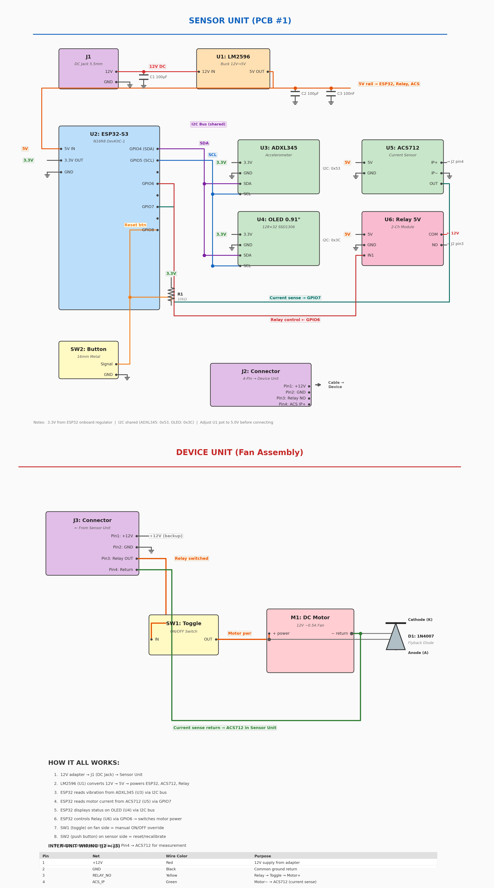
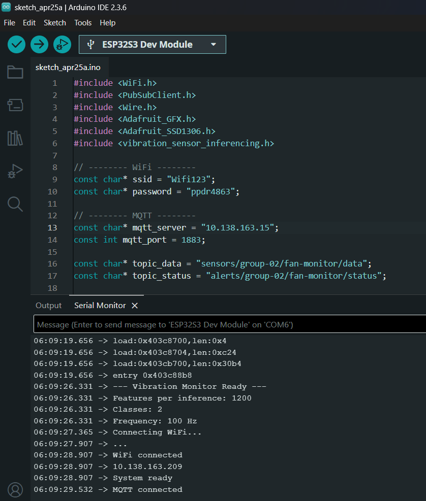

<p align="center">
  
  
  
  
  
</p>

# Accelerometer-Based Fan Health Monitoring & Anomaly Detection System

> A real-time embedded system that uses accelerometer vibration data and on-device machine learning to monitor the health of rotating fans, detect mechanical anomalies (imbalance, misalignment, bearing faults), and deliver live diagnostics through an IoT dashboard.
---
## Links
- **Video**: [Watch here](https://drive.google.com/drive/folders/1OtaXLBtRoM3G369fyFzQG8YVvY9XXsgt?usp=sharing)
- **Presentation**: [View here](https://drive.google.com/file/d/1IXMrvCZbRcrym2Vs-hd36GHyfgO51BNt/view?usp=sharing)
- **Report**: [Read here](https://drive.google.com/file/d/1zZ1DJQ25RavfkimF5q_RRZuxIZz3n_p0/view?usp=sharing)
---

---

## Table of Contents

- [Introduction](#introduction)
- [Problem Statement](#problem-statement)
- [Proposed Solution](#proposed-solution)
- [System Architecture](#system-architecture)
- [Hardware Design](#hardware-design)
- [ML Pipeline](#ml-pipeline)
- [Software Stack](#software-stack)
- [Repository Structure](#repository-structure)
- [Getting Started](#getting-started)
- [Deployment](#deployment)
- [Results](#results)
- [Team](#team)
- [Acknowledgements](#acknowledgements)
- [License](#license)

---

## Introduction

Industrial rotating machinery — fans, motors, turbines — are critical assets in manufacturing, HVAC, and power generation. Unexpected failures of these machines can cause **costly downtime**, **safety hazards**, and **cascading damage** to connected systems. Traditional maintenance strategies (run-to-failure or calendar-based schedules) are either reactive or wasteful, often replacing parts that still have useful life remaining.

**Predictive maintenance** powered by vibration analysis and machine learning offers a smarter approach: continuously monitoring equipment health, detecting early-stage faults, and triggering alerts *before* failure occurs. This project implements a complete, low-cost predictive maintenance pipeline — from sensor to dashboard — targeting ceiling fans and small DC motors as a proof of concept.

---

## Problem Statement

Conventional fan health monitoring relies on **manual periodic inspection**, which suffers from several limitations:

| Problem | Impact |
|---------|--------|
| **Late detection** | Faults are noticed only after performance degrades or failure occurs |
| **Subjective assessment** | Relies on human judgment (sound, visual check) — inconsistent and error-prone |
| **No historical tracking** | No data trail to analyze fault progression or predict remaining useful life |
| **High inspection costs** | Requires skilled technicians, physical access, and equipment downtime |
| **Scalability** | Cannot efficiently monitor hundreds of fans across a facility |

---

## Proposed Solution

We address these challenges with an **end-to-end IoT + Edge AI system** that:

1. **Senses** — Captures 6-axis vibration data (accelerometer + gyroscope) from a fan using an MPU9250 IMU at 100Hz
2. **Classifies** — Runs a trained TensorFlow Lite neural network *directly on the ESP32* microcontroller to classify vibration patterns in real-time (healthy vs. anomaly)
3. **Displays** — Shows health status and confidence on a local OLED screen for on-site operators
4. **Communicates** — Publishes inference results over MQTT to a broker for centralized processing
5. **Visualizes** — Renders live dashboards with fan status, historical trends, and alerts via Node-RED

### Key Advantages

- **Edge inference** — No cloud dependency; classification runs in ~10ms on-device
- **Low cost** — Under $15 in hardware (ESP32 + sensor + OLED)
- **Real-time** — 100Hz sampling with 2-second inference windows
- **Scalable** — MQTT architecture supports monitoring hundreds of fans
- **Dockerized backend** — One-command deployment of the full IoT stack

---

## System Architecture

```
┌─────────────────────────────────────────────────────────────────────┐
│                        SENSOR UNIT (PCB #1)                        │
│                                                                     │
│  ┌──────────┐    I2C     ┌───────────┐    SPI/I2C   ┌───────────┐  │
│  │ MPU9250  │◄──────────►│  ESP32-S3 │◄────────────►│ SSD1306   │  │
│  │ IMU      │  6-axis    │  DevKitC  │              │ OLED      │  │
│  │ @100Hz   │  data      │           │              │ 128×32    │  │
│  └──────────┘            │  ┌──────┐ │    GPIO      └───────────┘  │
│                          │  │TFLite│ │◄──────────── Push Button    │
│  ┌──────────┐            │  │Micro │ │                             │
│  │ ADXL345  │◄──────────►│  │Model │ │    GPIO      ┌───────────┐  │
│  │(testing) │  backup    │  └──────┘ │─────────────►│ Relay     │  │
│  └──────────┘            └─────┬─────┘              │ Module    │  │
│                                │ MQTT                └─────┬─────┘  │
│                                │ (WiFi)                    │        │
└────────────────────────────────┼───────────────────────────┼────────┘
                                 │                           │
                    ┌────────────▼────────────┐    ┌────────▼────────┐
                    │     MQTT Broker          │    │  DEVICE UNIT    │
                    │  (Eclipse Mosquitto)     │    │  DC Motor/Fan   │
                    │     Port 1883            │    │  + Flyback Diode│
                    └────────────┬─────────────┘    └─────────────────┘
                                 │
                    ┌────────────▼────────────┐
                    │     Node-RED            │
                    │  Dashboard (Port 1880)  │
                    │  - Live fan status      │
                    │  - Health classification│
                    │  - Vibration charts     │
                    │  - Alert system         │
                    └─────────────────────────┘
```

---

## Hardware Design

### Circuit Schematic



### Bill of Materials

| Component | Model | Specification | Purpose |
|-----------|-------|--------------|---------|
| Microcontroller | ESP32-S3 DevKitC-1 (N16R8) | Dual-core 240MHz, 16MB Flash, WiFi/BLE | Main processing unit |
| IMU Sensor | MPU9250 | 6-axis (accel ±4g, gyro ±500°/s), I2C @ 0x68 | Vibration data acquisition |
| Accelerometer | ADXL345 | ±16g, I2C @ 0x53 | Sensor testing & validation |
| OLED Display | SSD1306 | 128×32 pixels, I2C @ 0x3C | Local health status display |
| Relay Module | 5V 2-Channel | 12V switching, optocoupled | Fan motor control |
| Current Sensor | ACS712 | 5A range, analog output | Motor current monitoring |
| Voltage Regulator | LM2596 | 12V → 5V DC-DC buck converter | Power supply |
| Push Button | 16mm Metal | Momentary, pull-up | Fan ON/OFF toggle |
| Protection Diode | 1N4007 | Flyback protection | Motor inductive spike suppression |

### Pin Mapping (ESP32-S3)

| GPIO | Function | Connected To |
|------|----------|-------------|
| GPIO4 (SDA) | I2C Data | MPU9250, ADXL345, OLED (shared bus) |
| GPIO5 (SCL) | I2C Clock | MPU9250, ADXL345, OLED (shared bus) |
| GPIO6 | Relay Control | Relay Module IN1 |
| GPIO7 | Current Sense | ACS712 OUT (analog) |
| GPIO8 | Reset Button | SW2 (pull-up) |

### Inter-Unit Wiring (4-Pin Connector: J2↔J3)

| Pin | Net | Wire Color | Purpose |
|-----|-----|-----------|---------|
| 1 | +12V | Red | 12V supply from adapter |
| 2 | GND | Black | Common ground return |
| 3 | RELAY_NO | Yellow | Relay → Toggle → Motor+ |
| 4 | ACS_IP | Green | Motor− → ACS712 (current sense) |

---

## ML Pipeline

### Overview

The machine learning pipeline is built entirely on [Edge Impulse Studio](https://edgeimpulse.com/) and deployed as a compiled TFLite Micro model running natively on the ESP32-S3.

### Data Flow

```
Raw Sensor Data          DSP Processing           Neural Network          Output
┌─────────────┐    ┌──────────────────┐    ┌──────────────────┐    ┌──────────────┐
│ 6-axis IMU  │    │ Spectral Analysis│    │ Quantized NN     │    │ Class Label  │
│ @100Hz      │───►│ FFT (length=128) │───►│ (INT8, TFLite)   │───►│ + Confidence │
│ 2s window   │    │ Feature extract  │    │ 414 features     │    │ 2 classes    │
│ 200 samples │    │ Frequency domain │    │ ~3.4KB arena     │    │              │
└─────────────┘    └──────────────────┘    └──────────────────┘    └──────────────┘
```

### Model Specifications

| Parameter | Value |
|-----------|-------|
| **Training Platform** | Edge Impulse Studio |
| **Project ID** | 974007 |
| **Input Axes** | `ax + ay + az + gx + gy + gz` (6-axis fusion) |
| **Sampling Frequency** | 100 Hz |
| **Window Size** | 200 samples (2 seconds) |
| **DSP Block** | Spectral Analysis (FFT, 128-point) |
| **NN Input Features** | 414 |
| **Output Classes** | 2 (Healthy / Anomaly) |
| **Quantization** | INT8 (post-training quantization) |
| **Inference Engine** | TFLite Micro (compiled/EON) |
| **Arena Size** | 3,424 bytes |
| **Classification Threshold** | 0.6 (60% confidence) |

### Inference Pipeline on ESP32

1. **Calibration** — Compute sensor offsets from 500 static samples at boot
2. **Sampling** — Read MPU9250 at 100Hz (10ms intervals) via I2C
3. **Buffering** — Fill 1,200-element feature buffer (200 samples × 6 axes)
4. **DSP** — Edge Impulse SDK applies spectral analysis (FFT) to extract frequency-domain features
5. **Classification** — Run quantized neural network (TFLite Micro) on feature vector
6. **Output** — Display result on OLED, print to Serial, publish via MQTT

---

## Software Stack

| Layer | Technology | Purpose |
|-------|-----------|---------|
| **Firmware** | Arduino/C++ on ESP32-S3 | Sensor reading, ML inference, motor control |
| **ML Runtime** | Edge Impulse SDK + TFLite Micro | On-device inference engine |
| **Communication** | MQTT (Eclipse Mosquitto) | Lightweight pub/sub messaging |
| **Backend** | Python (edge AI container) | Data processing and MQTT bridge |
| **Dashboard** | Node-RED | Real-time visualization and alerting |
| **Orchestration** | Docker Compose | One-command deployment of IoT stack |
| **Build System** | Arduino IDE / PlatformIO | Firmware compilation and upload |

---

## Repository Structure

```
.
├── hardware/                          # ESP32 firmware source code
│   ├── Code_with_mqtt.ino             #   Full firmware with MQTT publishing
│   ├── Code_without_mqtt.ino          #   Standalone firmware (no network)
│   ├── accel_screen/                  #   MPU9250 + OLED integration test
│   ├── push_button/                   #   Push button test sketch
│   └── full_integration/              #   Complete hardware integration test
│
├── ml-model/                          # Machine Learning inference pipeline
│   ├── src/
│   │   ├── edge-impulse-sdk/          #   Edge Impulse TFLite Micro SDK
│   │   ├── model-parameters/          #   Model metadata & configuration
│   │   ├── tflite-model/              #   Trained TFLite model (INT8)
│   │   └── vibration_sensor_inferencing.h
│   ├── examples/                      #   Board-specific inference examples
│   │   └── esp32/                     #   ESP32 fusion, camera, mic examples
│   ├── sketch_apr25a/                 #   Main inference sketch
│   │   └── sketch_apr25a.ino          #   Full: MPU9250 → ML → OLED → Serial
│   ├── sensor_tests/                  #   Sensor validation firmware
│   ├── library.properties             #   Arduino library metadata
│   └── README.md                      #   ML module documentation
│
├── sensor_tests/                      # Standalone sensor test firmware
│   ├── platformio.ini                 #   PlatformIO config (ESP32-S3)
│   └── src/
│       └── main.cpp                   #   ADXL345 accelerometer test
│
├── python/                            # Edge AI & MQTT bridge services
│   ├── Dockerfile                     #   Python container build
│   ├── edge_ai.py                     #   Edge AI processing
│   └── mqtt_publisher.py              #   MQTT data publisher
│
├── mosquitto/                         # MQTT broker configuration
│   └── mosquitto.conf                 #   Mosquitto settings
│
├── node-red/                          # Dashboard & flow engine
│   ├── flows.json                     #   Node-RED flow definitions
│   ├── settings.js                    #   Node-RED configuration
│   └── package.json                   #   Node-RED dependencies
│
├── docs/                              # Project documentation & GitHub Pages
│   ├── images/
│   │   └── circuit_schematic.png      #   Hardware circuit diagram
│   ├── data/
│   │   └── index.json                 #   Team & project metadata
│   └── README.md                      #   Documentation site config
│
├── docker-compose.yml                 # Docker orchestration for IoT stack
└── README.md                          # This file
```

---

## Getting Started

### Prerequisites

- [Arduino IDE](https://www.arduino.cc/en/software) (v2.0+) or [PlatformIO](https://platformio.org/)
- [Docker](https://docs.docker.com/get-docker/) & [Docker Compose](https://docs.docker.com/compose/)
- ESP32-S3 board with USB-C cable
- Hardware components listed in [Bill of Materials](#bill-of-materials)

### 1. Clone the Repository

```bash
git clone https://github.com/cepdnaclk/e20-co326-accelerometer-based-fan-health-monitoring-and-anomaly-detection-system-group-02.git
cd e20-co326-accelerometer-based-fan-health-monitoring-and-anomaly-detection-system-group-02
```

### 2. Flash the Firmware

#### Option A: Arduino IDE

1. Open `ml-model/sketch_apr25a/sketch_apr25a.ino`
2. Install the ESP32 board package via Board Manager
3. Copy the `ml-model/` folder to your Arduino libraries directory
4. Select board: **ESP32S3 Dev Module**
5. Upload to the ESP32-S3

#### Option B: PlatformIO (Sensor Tests)

```bash
cd sensor_tests/
pio run --target upload
pio device monitor --baud 115200
```

### 3. Deploy the IoT Backend

```bash
# Start MQTT broker, Node-RED dashboard, and Python edge AI
docker-compose up -d

# Access the dashboard
open http://localhost:1880
```

### 4. Verify Operation

1. Press the push button to toggle the fan ON
2. Watch the OLED display for health classification
3. Monitor Serial output for inference results:
   ```
   Prediction: healthy | Confidence: 94.3% | DSP: 12ms | Classify: 3ms
   ```
4. Check the Node-RED dashboard for live vibration data

---

## Deployment

The IoT backend is fully containerized using Docker Compose:

```yaml
services:
  mqtt:           # Eclipse Mosquitto broker (port 1883)
  node-red:       # Node-RED dashboard (port 1880)
  python-edge:    # Python edge AI processor
```

```bash
# Start all services
docker-compose up -d

# View logs
docker-compose logs -f

# Stop all services
docker-compose down
```

| Service | Port | URL |
|---------|------|-----|
| MQTT Broker | 1883 | `mqtt://localhost:1883` |
| Node-RED Dashboard | 1880 | `http://localhost:1880` |

---


## Results

### Inference Performance (ESP32-S3)

| Metric | Value |
|--------|-------|
| DSP Processing Time | ~12ms |
| Classification Time | ~3ms |
| Total Inference Latency | ~15ms |
| Inference Window | 2 seconds (200 samples) |
| Memory Usage (Arena) | 3,424 bytes |
| Model Size | ~63KB (compiled) |

### Classification Output

The system classifies vibration patterns into one of 2 categories:

| Class | Description |
|-------|-------------|
| **Healthy** | Normal vibration signature — balanced operation |
| **Anomaly** | Abnormal vibration — potential imbalance, misalignment, or bearing fault |

---

## Methodology

### 1. Data Collection Phase
- Mount MPU9250 sensor on fan housing
- Record 6-axis vibration data at 100Hz for both healthy and faulty conditions
- Fault conditions induced by adding weight imbalance to fan blades

### 2. Model Training Phase
- Upload datasets to Edge Impulse Studio
- Apply spectral analysis DSP block (128-point FFT)
- Train neural network classifier with post-training INT8 quantization
- Validate accuracy on held-out test set

### 3. Deployment Phase
- Export trained model as Arduino library from Edge Impulse
- Integrate with ESP32 firmware for real-time inference
- Connect to IoT backend via MQTT for remote monitoring

### 4. Validation Phase
- Test classification accuracy on live fan under various conditions
- Measure inference latency and power consumption
- Verify MQTT data pipeline end-to-end

---

## Team

| Name | Registration | Email | Role |
|------|-------------|-------|------|
| D.M.T. Dilshan | E/20/069 | [e20069@eng.pdn.ac.lk](mailto:e20069@eng.pdn.ac.lk) | ML Pipeline & Edge AI |
| N.R.P. Gunathilake | E/20/122 | [e20122@eng.pdn.ac.lk](mailto:e20122@eng.pdn.ac.lk) | IoT Dashboard & MQTT |
| N.K.D.P. Jayawardena | E/20/178 | [e20178@eng.pdn.ac.lk](mailto:e20178@eng.pdn.ac.lk) | Hardware & Firmware |
| K.N.P. Karunarathne | E/20/189 | [e20189@eng.pdn.ac.lk](mailto:e20189@eng.pdn.ac.lk) | Hardware Integration, Component Testing, MQTT Data Transmission |

### Supervisor

**Prof. Kamalanath Samarakoon** — Department of Computer Engineering, University of Peradeniya

---

## Acknowledgements

- **[Edge Impulse](https://edgeimpulse.com/)** — ML model training and deployment platform
- **[Eclipse Mosquitto](https://mosquitto.org/)** — Lightweight MQTT broker
- **[Node-RED](https://nodered.org/)** — Flow-based IoT dashboard
- **Department of Computer Engineering, University of Peradeniya** — CO326 course module
- **TensorFlow Lite Micro** — On-device ML inference runtime

---

## License

This project is developed as part of the **CO326 — Computer Systems Engineering** course at the **University of Peradeniya**, Sri Lanka.

---

<p align="center">
  <sub>Built by Group 02 — Department of Computer Engineering, University of Peradeniya</sub>
</p>
